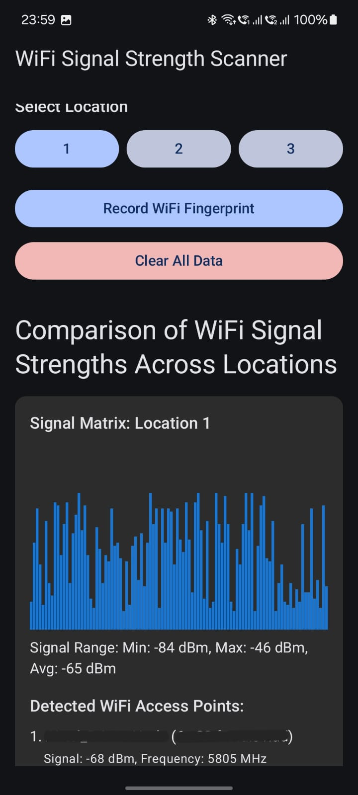
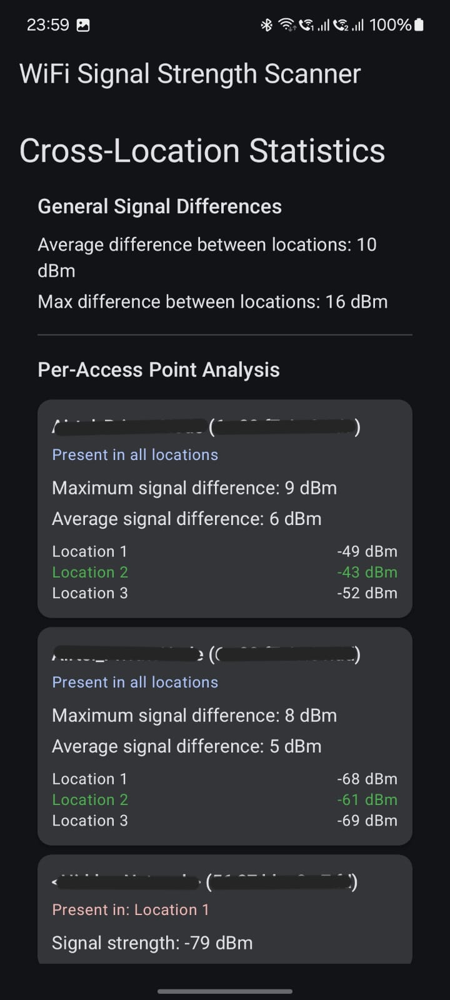

# WiFi Signal Fingerprinting Application

A mobile application for Android that captures, visualizes, and analyzes WiFi signal strength fingerprints across different locations. This app uses statistical techniques to generate rich signal matrices from limited scan data, making it ideal for indoor positioning research and development.

## Features

- **WiFi Signal Scanning**: Capture WiFi signal fingerprints at different locations
- **Statistical Signal Matrix Generation**: Creates a 100-element signal matrix with realistic variations from a single scan
- **Visual Signal Representation**: Visualizes WiFi signal strength data across different locations
- **Cross-Location Analysis**: Calculates differences between locations to identify distinguishing characteristics
- **Per-Access Point Statistics**: Analyzes individual access points to determine which ones are most useful for location fingerprinting

## Screenshots

## How It Works

### Data Collection

The app collects WiFi signal strengths from nearby access points (routers) and creates a signal fingerprint for each location. Since Android limits the frequency of WiFi scans, the application uses statistical expansion to generate a rich dataset from a single scan.

### Statistical Expansion

For each location scan:
1. Collects real signal strength readings from all detected access points
2. Analyzes the statistical properties of the real readings (min, max, average, standard deviation)
3. Generates additional signal readings with appropriate variations based on the statistical properties
4. Creates a 100-element signal matrix with realistic variations of the original scan data

### Signal Analysis

The app performs two types of analysis:

#### General Statistics

- **Average Signal Difference**: The average difference in signal strength between locations
- **Maximum Signal Difference**: The maximum difference in signal strength between any two locations

Example: If Location A has an average signal of -65 dBm and Location B has -75 dBm, there's a 10 dBm difference, which can be used to distinguish between these locations.

#### Per-Access Point Analysis

- **Maximum Signal Difference**: The maximum difference in signal strength for a specific access point across locations
- **Average Signal Difference**: The average pairwise difference between locations for a specific access point
- **Best Signal Location**: The location with the strongest signal for each access point

Example: If an access point "MyRouter" has signal strengths of -60 dBm, -72 dBm, and -85 dBm across three locations, the maximum difference is 25 dBm, making this access point very useful for distinguishing between these locations.

## Technical Details

- **Language**: Kotlin
- **UI Framework**: Jetpack Compose
- **Storage**: DataStore Preferences
- **Architecture**: MVVM (Model-View-ViewModel)
- **Permissions Required**: WiFi State, Location

## Requirements

- Android 7.0 (API level 24) or higher
- WiFi-enabled device
- Location permissions enabled

## Development Setup

1. Clone the repository
2. Open the project in Android Studio
3. Build and run on a compatible Android device